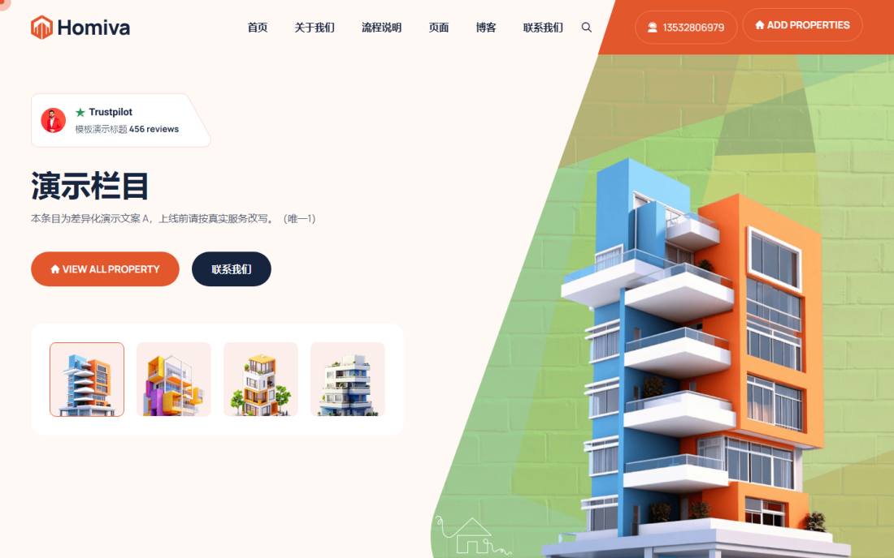
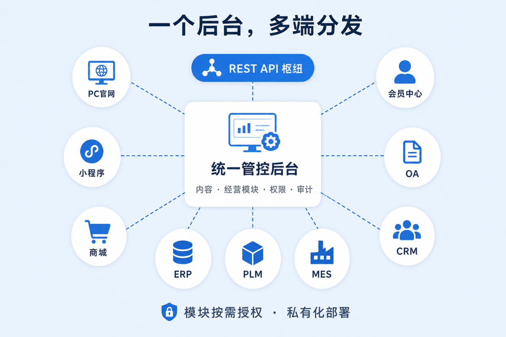

<h1 align="center">元舟 PivArk</h1>

<p align="center">
  <b>为企业赋能<br/>让数字化变成可经营的数字资产</b>
</p>

<p align="center">
  <b>可私有化部署的企业数字资产中枢</b>（开源 CMS / 门户平台，非单页脚本）<br/>
  一个系统 · 一个内核 · 一套后台 · 多端分发
</p>

<p align="center">
  <a href="https://www.pivark.cn"><b>官网</b></a>
  · <a href="https://www.pivark.cn/docs/">文档</a>
  · <a href="https://demo.pivark.cn"><b>在线演示</b></a>
  · <a href="https://gitee.com/pivark/pivark/releases"><b>下载 Community 1.6.5</b></a>
</p>

<p align="center">
  
  
  
  
  
  
</p>

---

## 30 秒读懂

| 问题 | 答案 |
|------|------|
| **它是什么** | 企业级 **内容 + 门户 + 会员 + 开放 API** 中枢；可私有化部署的 **PHP 应用**（ThinkPHP 8 + Vue3 后台），不是浏览器插件、也不是单文件脚本 |
| **适用场景** | 品牌官网 / 资讯站、产品展示与下载、会员中心、可扩展商城与小程序对接、需要源码自主可控的政企与制造业数字化入口 |
| **不适用** | 纯静态单页、无服务端运维能力、只想要托管 SaaS 而不碰服务器 |
| **技术栈** | **PHP 8.1+** · **ThinkPHP 8** · **MySQL 8** · 后台 **Vue 3 + Element Plus**；可选 Redis / MeiliSearch / 对象存储 |
| **怎么验证** | 看下方截图 → 打开 [演示站](https://demo.pivark.cn) → 或按「5 分钟跑起来」本地安装 |

本仓库是 **Community 完整发行树**（含 `app/` `template/` `weapp/` `vendor/` `install/`），可直接部署；提交历史与编码可在本仓 `master` / `dev` 分支浏览。

---

## 演示与截图

| 在线演示 | 说明 |
|----------|------|
| https://demo.pivark.cn | Community / 基础能力演示（前台） |
| https://pro.pivark.cn | 专业版演示 |
| 后台入口 | 演示站路径 `/admin`（账号以演示页说明为准） |

**门户主题样例**（模板市场预览图，装机后可切换主题）：

<p align="center">
  
  
  
</p>

**架构示意**（一套后台，多端分发）：

<p align="center">
  
</p>

---

## 它解决什么

多数企业站止步于「页面能上线」。PivArk 面向更长的问题：

**资产还在不在、经营起得来起不来、以后扩能力还要不要推翻重来。**

官网、会员、商城与开放接口跑在**同一内核**：数据同源、权限同源、升级同源。能力按站点按需激活。

- **一体中枢，按需生长** — 先门户与运营，再点亮下载、商城、小程序等；不是多套后台、多份导出表  
- **导航与内容解耦** — 改栏目不必搬正文；列表 / 详情 / 单页 + 品项体系可接商城  
- **插件扩展，不重造轮子** — 支付 / 搜索 / 会员 / 上传在内核；插件只补业务场景  

Community 可免费下载商用；去版权、升级保障与 **OA / CRM / ERP / PLM / MES** 等企业经营模块走商业授权——**同一产品线，不是两套系统。**

| 能力 | 含义 |
|------|------|
| 统一后台管控 | 内容 · 经营模块 · 权限 · 审计 |
| 开放 API 互联 | REST 与前台同源 |
| 模块按需授权 | 经营模块按站点点亮 |
| 私有化独立部署 | 源码可审，数据留在自有机房 |

---

## 技术栈与仓库结构

| 层 | 技术 / 路径 |
|----|-------------|
| 后端 | PHP 8.1+ · ThinkPHP 8 · `app/` `config/` |
| 数据 | MySQL 8.0+ · 运行态 `data/` |
| 前台 | 主题 `template/` |
| 后台 | Vue 3 · Element Plus（发行包内已构建静态资源） |
| 插件 | `weapp/{id}/`（经 Gateway，勿改内核 `app/`） |
| 安装 | `install/` 向导 |

架构说明：[docs/ARCHITECTURE.md](docs/ARCHITECTURE.md)  
编码与贡献：[CONTRIBUTING.md](CONTRIBUTING.md) · 分支：[docs/BRANCHING.md](docs/BRANCHING.md)

```text
.
├── app/           # PHP 应用与领域服务
├── template/      # 前台主题
├── weapp/         # 插件
├── install/       # 安装向导
├── public/        # Web 入口与静态资源（含后台 dist）
├── vendor/        # PHP 依赖（发行树已带）
├── docs/          # 安装 / 升级 / 安全 / 架构 / 插件入门
├── LICENSE        # Community 开源许可
└── README.md
```

---

## 5 分钟跑起来（部署 / 安装 / 使用）

### 1）环境

| 依赖 | 要求 |
|------|------|
| PHP | **8.1+**（`pdo_mysql` `json` `mbstring` `openssl` `curl`；建议 `gd` `zip` `fileinfo`） |
| MySQL | **8.0+** |
| Web | Nginx / Apache / IIS（宝塔可） |
| 可写 | `data/` · `data/runtime/` · `public/uploads/` |

### 2）下载完整安装包（推荐）

> 建站请用 **完整安装包**。GitHub/Gitee 自动源码包 ≠ 装机包。

| 来源 | 链接 |
|------|------|
| Gitee | https://gitee.com/pivark/pivark/releases/download/v1.6.5/pivark-community-install-1.6.5.zip |
| GitHub | https://github.com/pivark/pivark/releases/download/v1.6.5/pivark-community-install-1.6.5.zip |
| 官网镜像 | https://www.pivark.cn/static/release/pivark-community-install-1.6.5.zip |

SHA256：`cd58541e740cbd33d07a52794c7889090db94f698823729679c2398237a28a6a`

也可 `git clone` 本仓后，将站点根指到仓库根目录（需已含 `vendor/` 的完整树）。

### 3）安装向导

1. 解压到网站根（根目录应有 `index.php`，勿多套一层空文件夹）  
2. 创建数据库，绑定域名，PHP ≥ 8.1  
3. 浏览器打开站点 → **`/install`**  
4. **环境检测 → 数据库（先测连接）→ 自设管理员 → 完成**  
5. 打开 **`/admin`** 登录；前台 **`/`**

**没有出厂默认账号。** 管理员在向导中自设；装完立即改密。

### 4）装完你可以先做什么

1. 后台改站点名称 / Logo  
2. 看「栏目 / 内容 / 品项」是否能发布一篇并在前台打开  
3. 按需装插件（插件市场或本地 `weapp/`）  
4. 上线前读 [部署安全](#部署安全必读)

全文：[docs/INSTALL.md](docs/INSTALL.md)

---

## 部署安全（必读）

1. 限制或删除 `/install`  
2. 确认存在 `data/install.lock`  
3. 关闭调试，勿对外暴露异常栈  
4. 后台走 HTTPS  
5. 收紧写权限；升级前备份库与 `data/`、上传目录  

→ [docs/SECURITY.md](docs/SECURITY.md)

---

## 开源协议与维护者

| 项 | 说明 |
|----|------|
| **协议** | **PivArk Community 开源许可**（source-available，**不是** MIT/Apache） |
| **允许** | 学习、私有部署、二次开发、**商用**（须保留版权标识） |
| **商业加购** | 去版权、在线升级、企业经营模块等 — 官网定价 |
| **全文** | [LICENSE](LICENSE) |
| **谁在维护** | 项目组持续维护 1.6.x；Issues + 安全私下通报 |
| **维护说明** | [docs/MAINTAINERS.md](docs/MAINTAINERS.md) |

---

## 升级与插件

- 升级：[docs/UPGRADE.md](docs/UPGRADE.md)（授权站后台升级 / 开源自备包 + 库迁移）  
- 插件开发：只写 `weapp/{id}/` → [docs/PLUGIN-DEV.md](docs/PLUGIN-DEV.md)

---

## 分支与协作

**`master`（稳定）· `dev`（集成）· `maint/1.6.5`（本版维护）**

外人：Fork → PR 打 **`dev`**。详见 [docs/BRANCHING.md](docs/BRANCHING.md) · [CONTRIBUTING.md](CONTRIBUTING.md)

```bash
git clone https://gitee.com/pivark/pivark.git
# 或 git clone https://github.com/pivark/pivark.git
```

---

## 仓库文档索引

| 文档 | 说明 |
|------|------|
| [docs/INSTALL.md](docs/INSTALL.md) | 安装 |
| [docs/UPGRADE.md](docs/UPGRADE.md) | 升级 |
| [docs/SECURITY.md](docs/SECURITY.md) | 安全 |
| [docs/ARCHITECTURE.md](docs/ARCHITECTURE.md) | 架构 / 技术栈 / 读码顺序 |
| [docs/PLUGIN-DEV.md](docs/PLUGIN-DEV.md) | 插件入门 |
| [docs/BRANCHING.md](docs/BRANCHING.md) | 分支 |
| [docs/MAINTAINERS.md](docs/MAINTAINERS.md) | 维护者与支持 |
| [LICENSE](LICENSE) | 许可全文 |

在线手册：https://www.pivark.cn/docs/

---

<p align="center">
  <b>元舟 PivArk</b><br/>
  为企业赋能 · 让数字化变成可经营的数字资产<br/>
  <i>一个系统 · 一个内核 · 一套后台 · 多端分发</i><br/>
  © 2024–2026 pivark.cn
</p>